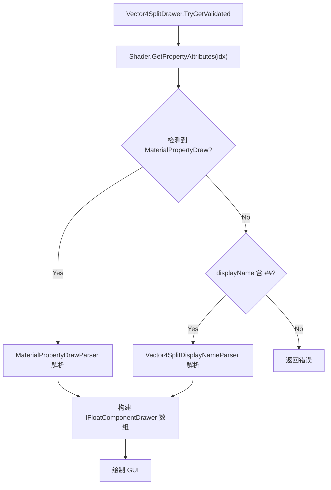

# 重构 Vector4Split：使用 MaterialPropertyDraw 装饰器

## 现状问题

当前所有分量配置都塞在 displayName 中，导致声明非常冗长：

```hlsl
[Vector4Split(FourFloats)]_BaseMapToggles("主贴图开关 ## 开启预乘Alpha(禁动画中K开关)|Toggle @ 去黑底(禁动画中K开关)|Toggle @ 开启极坐标(禁动画中K开关)|Toggle @ 切换为2U(禁动画中K开关)|Toggle", Vector) = (0,0,0,0)
```

## 目标语法

改为多个独立的 `[MaterialPropertyDraw]` 装饰器 + 简化的 `[Vector4Split]`：

```hlsl
[MaterialPropertyDraw("开启预乘Alpha(禁动画中K开关)", Toggle, 0)]
[MaterialPropertyDraw("去黑底(禁动画中K开关)", Toggle, 0)]
[MaterialPropertyDraw("开启极坐标(禁动画中K开关)", Toggle, 0)]
[MaterialPropertyDraw("切换为2U(禁动画中K开关)", Toggle, 0)]
[Vector4Split]_BaseMapToggles("主贴图开关", Vector) = (0,0,0,0)
```

各类型语法：

- **Float**: `[MaterialPropertyDraw("标签", Float, defaultValue)]`
- **Slider/Range**: `[MaterialPropertyDraw("标签", Range, defaultValue, min, max)]`
- **Toggle**: `[MaterialPropertyDraw("标签", Toggle, defaultValue)]`
- **Hidden**: `[MaterialPropertyDraw("隐藏", Hidden, 0)]`
- **Enum (新增)**: `[MaterialPropertyDraw("标签", Enum, defaultValue, 选项A, 0, 选项B, 1, 选项C, 2)]`

## 技术方案

利用 Unity `Shader.GetPropertyAttributes(idx)` API，让 `Vector4SplitDrawer` 在运行时读取同一 Property 上所有 attribute 字符串，解析出 `MaterialPropertyDraw(...)` 配置。

`MaterialPropertyDraw` 本身实现为 `MaterialDecoratorDrawer`（高度 0、不绘制），仅作为数据标记。

## 需要修改的文件

### 1. 新建 `MaterialPropertyDrawDecorator.cs`

路径: [Assets/Editor/Theseus/ShaderGUI/ModuleShaderGUI/Drawers/MaterialPropertyDrawDecorator.cs](Assets/Editor/Theseus/ShaderGUI/ModuleShaderGUI/Drawers/MaterialPropertyDrawDecorator.cs)

- 创建 `MaterialPropertyDrawDrawer` 类，继承 `MaterialDecoratorDrawer`
- 多个构造函数重载以支持不同参数数量（Unity 的 MaterialPropertyDrawer 参数只支持 string 和 float）
- `GetPropertyHeight` 返回 0，`OnGUI` 不绘制任何内容

### 2. 修改 `Vector4SplitDrawerData.cs`

路径: [Assets/Editor/Theseus/ShaderGUI/ModuleShaderGUI/Drawers/Vector4SplitDrawerData.cs](Assets/Editor/Theseus/ShaderGUI/ModuleShaderGUI/Drawers/Vector4SplitDrawerData.cs)

- `FloatDrawType` 枚举新增 `Enum` 类型
- `ComponentConfig` 新增 `EnumNames` (string[]) 和 `EnumValues` (int[]) 字段
- 新增 `MaterialPropertyDrawParser` 静态类，负责从 attribute 字符串数组中解析 `MaterialPropertyDraw(...)` 配置
- 保留 `Vector4SplitDisplayNameParser` 以支持向后兼容

### 3. 修改 `FloatComponentDrawers.cs`

路径: [Assets/Editor/Theseus/ShaderGUI/ModuleShaderGUI/Drawers/FloatComponentDrawers.cs](Assets/Editor/Theseus/ShaderGUI/ModuleShaderGUI/Drawers/FloatComponentDrawers.cs)

- 新增 `EnumComponentDrawer` 类，实现 `IFloatComponentDrawer`
  - 使用 `EditorGUI.IntPopup` 绘制下拉框
  - 构造函数接收 `string[] names` 和 `int[] values`
- `ComponentDrawerFactory.Create` 新增 `FloatDrawType.Enum` 分支

### 4. 修改 `Vector4SplitDrawer.cs`

路径: [Assets/Editor/Theseus/ShaderGUI/ModuleShaderGUI/Drawers/Vector4SplitDrawer.cs](Assets/Editor/Theseus/ShaderGUI/ModuleShaderGUI/Drawers/Vector4SplitDrawer.cs)

- 新增无参构造函数 `Vector4SplitDrawer()`，默认 `FourFloats` 模式
- 修改 `TryGetValidated` 方法：
  - 先尝试通过 `MaterialEditor` / `MaterialProperty` 获取 Shader 上的 attribute 列表
  - 若检测到 `MaterialPropertyDraw(...)` attribute，使用新的 `MaterialPropertyDrawParser` 解析
  - 若未检测到，回退到原有的 `Vector4SplitDisplayNameParser` 解析 displayName
- 将 `MaterialEditor editor` 参数传入 `TryGetValidated`，以便调用 `Shader.GetPropertyAttributes`

### 5. 修改 Shader 文件（后续可选）

以下 shader 文件可以在确认 Drawer 正确工作后逐步迁移到新语法：

- [Assets/Shaders/ShaderTheseus/Effect/Theseus_MeshEffect_CommonSF.shader](Assets/Shaders/ShaderTheseus/Effect/Theseus_MeshEffect_CommonSF.shader)
- [Assets/Shaders/ShaderTheseus/Effect/Theseus_ParticleEffect_CommonSF.shader](Assets/Shaders/ShaderTheseus/Effect/Theseus_ParticleEffect_CommonSF.shader)
- 以及 `_Modular` 后缀的两个 shader 文件

## 向后兼容

- 旧语法（displayName 中含 `##`）继续完全支持
- 新语法（`MaterialPropertyDraw` + 简化的 `Vector4Split`）优先级更高
- 两种语法不应混用在同一个 Property 上

## 属性解析流程




