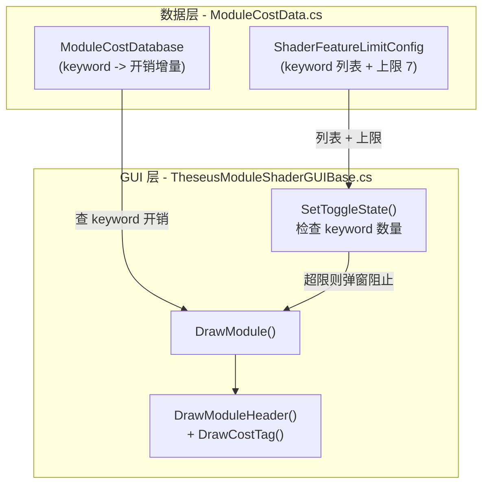

# Shader 模块性能开销 GUI 提示方案

## 核心思路

两项功能合并在同一套改动中：

1. **模块开销标签**：在模块标题栏右侧显示彩色等级标签（绿/黄/红），悬浮 Tooltip 展示 Work Reg / Uniform Reg / Load-Store / Arithmetic 增量
2. **keyword 数量上限守卫**：统计材质上所有已启用的 shader_feature_local keyword 数量，当用户试图开启第 8 个（超过上限 7）时弹出 `EditorUtility.DisplayDialog` 阻止并自动回退

## 架构设计




## 涉及文件

### 1. 新增: `ModuleCostData.cs`

路径: `[Assets/Editor/Theseus/ShaderGUI/ModuleShaderGUI/ModuleCostData.cs](Assets/Editor/Theseus/ShaderGUI/ModuleShaderGUI/ModuleCostData.cs)`

存放性能开销数据、评估逻辑，以及 keyword 数量限制配置：

```csharp
namespace TheseusEditor
{
    // ── 模块开销数据 ──
    public struct ShaderModuleCost
    {
        public int WorkRegisters;
        public int UniformRegisters;
        public int LoadStore;
        public int Arithmetic;
    }

    public enum CostLevel { Low, Medium, High }

    public static class ModuleCostDatabase
    {
        private static readonly Dictionary<string, ShaderModuleCost> _costs = new ...;

        public static bool TryGetCost(string keyword, out ShaderModuleCost cost);
        public static CostLevel Evaluate(ShaderModuleCost cost);
    }

    // ── shader_feature_local 数量限制 ──
    public static class ShaderFeatureLimitConfig
    {
        public const int MaxEnabledKeywords = 7;

        // 各 shader 需要计数的所有 shader_feature_local keyword
        // key = shader name, value = 该 shader 声明的全部 sf_local keyword
        private static readonly Dictionary<string, string[]> _shaderKeywords
            = new Dictionary<string, string[]>
        {
            {
                "Theseus/VFX/MeshEffect_CommonSF",
                new[] {
                    "_ENABLE_SCREEN_UV", "_MIX_BASE_ON", "_FALLOFF_DISSOLVE_ON",
                    "_FLOW_MAP_ON", "_NOISE_ON", "_ENABLE_VERTEX_OFFSET",
                    "_FRESNEL_ON", "_ENABLE_PLANAR_SOFT_PARTICLE",
                    "_GRADIENT_ON", "_COLOUR_ON"
                }
            },
            {
                "Theseus/VFX/ParticleEffect_CommonSF",
                new[] {
                    "_REQUIRE_CUSTOMDATA", "_ENABLE_SCREEN_UV", "_MIX_BASE_ON",
                    "_FALLOFF_DISSOLVE_ON", "_FLOW_MAP_ON", "_NOISE_ON",
                    "_ENABLE_VERTEX_OFFSET", "_FRESNEL_ON",
                    "_ENABLE_PLANAR_SOFT_PARTICLE", "_GRADIENT_ON", "_COLOUR_ON"
                }
            }
        };

        public static bool TryGetKeywords(string shaderName, out string[] keywords);

        public static int CountEnabled(Material material, string[] keywords);
    }
}
```

### 2. 修改: `[ModuleShaderGUIData.cs](Assets/Editor/Theseus/ShaderGUI/ModuleShaderGUI/ModuleShaderGUIData.cs)`

在 `ModuleEntry` 中缓存开销数据：

```csharp
public class ModuleEntry
{
    // ... 现有字段 ...
    public ShaderModuleCost? Cost;  // 模块开销数据（仅 keyword 模块有值）
}
```

### 3. 修改: `[TheseusModuleShaderGUIBase.cs](Assets/Editor/Theseus/ShaderGUI/ModuleShaderGUI/TheseusModuleShaderGUIBase.cs)`

#### 3a. `CreateModuleEntry` 中填充 Cost

当 `ToggleType == Keyword` 时查询 `ModuleCostDatabase`，赋值 `Cost` 字段。

#### 3b. `DrawModuleHeader` 中绘制开销标签

新增 `DrawCostTag(Rect headerRect, ShaderModuleCost? cost, bool isEnabled)` 方法：

- 标签样式：小圆角矩形背景 + 文字（"Low" / "Mid" / "High"）
- 颜色编码：Low = 绿色、Medium = 黄色、High = 红色
- 已启用模块正常显示；未启用模块半透明灰色
- Tooltip 格式：`Work Reg: +2 | Uniform Reg: +4\nLoad/Store: +1 | Arithmetic: +6`

#### 3c. keyword 数量上限守卫

在 `DrawModule` 方法中，当用户通过 header toggle 尝试开启一个 keyword 时：

1. 调用 `ShaderFeatureLimitConfig.TryGetKeywords(shader.name)` 获取该 shader 的 keyword 列表
2. 调用 `ShaderFeatureLimitConfig.CountEnabled(material, keywords)` 统计当前已启用数量
3. 如果 `当前已启用数 >= MaxEnabledKeywords (7)` 且用户正在从 Off -> On：
  - 调用 `EditorUtility.DisplayDialog("性能警告", "当前已开启 N 个 Shader Feature，最大允许 7 个。请先关闭其他模块后再开启此模块。", "确定")` 弹窗
  - **不执行** `SetToggleState`，保持模块关闭状态（自动回退）
4. 否则正常执行 `SetToggleState`

关键代码位置在 `DrawModule` 方法（约第 177-215 行）中处理 `newEnabled != isEnabled` 的分支：

```csharp
if (hasToggle && newEnabled != isEnabled)
{
    // 开启守卫：检查 keyword 数量是否超限
    if (newEnabled && module.ToggleType == ModuleToggleType.Keyword
        && !CanEnableKeyword(material))
    {
        // 弹窗提示，不执行开启
    }
    else
    {
        SetToggleState(material, module.ToggleType, toggleTarget, newEnabled);
    }
}
```

`CanEnableKeyword` 逻辑封装查询 + 计数 + 比较上限。

## UI 效果预览

正常状态（5 个模块已开启）：

```
┌─────────────────────────────────────────────────────────┐
│ ▶ ☑ 混合贴图设置                              [Mid ▲]  │
├─────────────────────────────────────────────────────────┤
│ ▶ ☑ 溶解设置                                  [High▲]  │
├─────────────────────────────────────────────────────────┤
│ ▶ ☐ Fresnel设置                               [Low  ]  │  <- 灰色半透明（未开启）
└─────────────────────────────────────────────────────────┘
```

超限弹窗（尝试开启第 8 个时）：

```
┌──────────── 性能警告 ────────────┐
│                                  │
│  当前已开启 7 个 Shader Feature，│
│  最大允许开启 7 个。             │
│  请先关闭其他模块后再开启此模块。│
│                                  │
│            [ 确定 ]              │
└──────────────────────────────────┘
```

## 数据填充策略

- `ModuleCostDatabase` 字典预留所有 keyword 占位，待报告数据填入
- `ShaderFeatureLimitConfig` 中的 keyword 列表已从 shader 文件中提取完毕
- 如果后续新增 shader 或 keyword，只需在对应字典中增加条目
- 上限值 `MaxEnabledKeywords = 7` 作为常量集中管理，后续可调整

