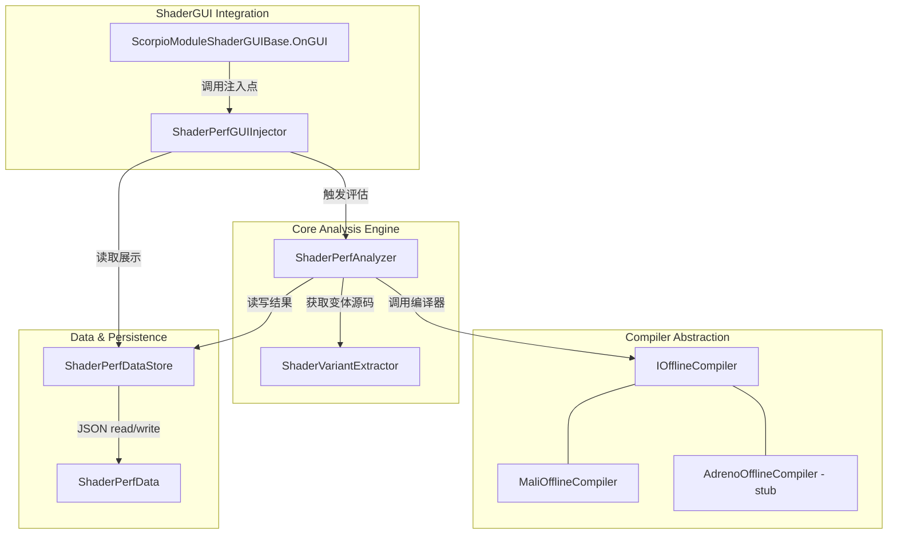

# Scorpio 离线 Shader 性能分析评估工具

## 原始需求

基于现有的 ScorpioModuleShaderGUIBase 模块化 GUI 系统，开发一套针对移动端平台的"离线 Shader 性能分析评估工具"(Offline Shader Profiling Tool)。此工具能够将 TA 编写的 Shader 源码发送给各大硬件厂商的离线编译器（Mali Offline Compiler 等）进行评估，并将精确的性能指标（如运算周期 Cycles、寄存器占用 Registers 等）直观地反馈在材质的 Inspector 面板中。

核心需求包含 5 个阶段：

1. **多平台离线编译器集成接口 (Compiler Abstraction)**：设计 IOfflineCompiler 抽象接口，详细实现 MaliOfflineCompiler 作为范例。支持 Mali/Adreno/PowerVR/Apple Silicon 硬件平台预留，GLES3/Vulkan/Metal/DX 图形 API 预留。基于 Process.Start 静默拉起外部可执行文件，通过正则/JSON 解析终端输出提取 Arithmetic cycles、Load/Store cycles、Texture cycles、Work registers 等关键数据。
2. **Shader 变体代码提取与分段截取 (Variant Extraction)**：通过反射调用 ShaderUtil.OpenCompiledShader 或 ShaderUtil.GetShaderVariantEntries 获取编译结果文本。编写正则/字符串解析逻辑，给定 Shader 路径和激活 Keywords 数组，从编译结果中精确截取对应的纯净 Fragment Shader 源码。
3. **状态检测与持久化 (State Checking & Persistence)**：ShaderPerfData 数据结构序列化为 JSON 存入 Library/ScorpioShaderPerf/。包含 Shader 名称、源码综合依赖 Hash（AssetDatabase.GetAssetDependencyHash）、Base Cycles、每个 Keyword 模块增量开销。历史记录追踪：保存上一次评估数据，UI 展示优化（绿色箭头）或变差（红色箭头）。
4. **Shader GUI 交互集成 (ShaderGUI Integration)**：在 ScorpioModuleShaderGUIBase 的 OnGUI 流程前部注入逻辑。实时 Hash 比对，不一致时黄色 HelpBox 警告 + 重新评估按钮（多平台下拉多选），一致时显示 Base Cycles 及历史变化。超标阈值告警（如 Mali G77 Arithmetic Cycles > 30 飘红）。
5. **自动化与外围功能 (Automation & Tooling)**：模块化增量分析（Base → Base+Keyword 循环）。CI/CD 无头入口 ScorpioPerfAnalyzer.RunBatchAnalysis。CSV 导出 Editor 菜单项。

约束条件：所有代码在 ScorpioEditor 命名空间下；UI 交互严禁阻塞 OnGUI，必须异步分帧处理；使用 C# 作为唯一编程语言。

## 需求变更记录

- **迭代 1**：补充 Mali Offline Compiler 跨平台调用要求。`Editor/Plugins/mali_offline_compiler/` 下 `win/` 对应 Windows 版本，`mac/` 对应 macOS 版本，MaliOfflineCompiler 实现需根据 Editor 运行平台选择对应目录下的可执行文件。经实际检测发现 mac 目录下的 `malioc.exe` 当前也是 PE32+ Windows 可执行文件（非 macOS 原生二进制），需在代码中做可用性检测与降级提示。

## 现有代码库关键发现

- **ScorpioModuleShaderGUIBase** ([ScorpioModuleShaderGUIBase.cs](Packages/com.scorpio.vfxtoolset/Editor/ShaderGUI/ModuleShaderGUI/ScorpioModuleShaderGUIBase.cs))：`OnGUI` 不是 `virtual`，所有绘制方法为 `private`/`private static`，**无法通过继承注入顶部 UI**。需要将 `OnGUI` 改为可扩展的模式（提取 `virtual` 方法或直接在 `OnGUI` 中调用性能分析 UI 注入点）。
- **Mali Offline Compiler** 已内置于 `Packages/com.scorpio.vfxtoolset/Editor/Plugins/mali_offline_compiler/`，目录结构为 `win/malioc.exe`（Windows）和 `mac/malioc.exe`（macOS）。**重要发现**：经 `file` 命令检测，mac 目录下的 `malioc.exe` 当前实际也是 PE32+ Windows 可执行文件，并非 macOS 原生二进制，在 macOS 上无法直接运行。代码中需做平台可用性检测，macOS 不可用时给出明确提示。两个目录均包含 `graphics/` 子目录（GPU 模型库 .dll）、`external/glslang.exe`、`samples/`（含 `json_reports/performance-report.json` 和 `json_schemas/performance-schema.json`）。malioc 支持 `--format json` 参数直接输出结构化 JSON 报告。
- **异步模式**：项目已有 `ShaderMemoryTestCoroutineUtility`（[ShaderMemoryTestWindow.cs:257-289](Packages/com.scorpio.vfxtoolset/Editor/ShaderMemoryTest/ShaderMemoryTestWindow.cs)）基于 `EditorApplication.update` 驱动 `IEnumerator`，可复用此模式。
- **缓存路径**：项目已有 `Library/ReferenceFinderCache` 的先例，性能数据存入 `Library/ScorpioShaderPerf/` 符合项目惯例。
- **命名空间**：所有编辑器代码在 `ScorpioEditor` 命名空间下。
- **包结构**：`Packages/com.scorpio.vfxtoolset/Editor/` 下无 `.asmdef`，使用 Unity 默认包程序集。新文件放在此目录下即可。

## 整体架构




## 文件结构规划

所有新文件放在 `Packages/com.scorpio.vfxtoolset/Editor/ShaderPerf/` 目录下：

```
Editor/ShaderPerf/
  Compiler/
    IOfflineCompiler.cs          -- 抽象接口 + 数据结构
    MaliOfflineCompiler.cs       -- Mali 实现（调用 malioc --format json）
    OfflineCompilerRegistry.cs   -- 编译器注册表（工厂模式）
  Data/
    ShaderPerfData.cs            -- 性能数据结构（JsonUtility 序列化）
    ShaderPerfDataStore.cs       -- JSON 持久化（Library/ScorpioShaderPerf/）
  Core/
    ShaderVariantExtractor.cs    -- 变体源码提取（反射 ShaderUtil）
    ShaderPerfAnalyzer.cs        -- 核心分析引擎（异步分帧）
  GUI/
    ShaderPerfGUIInjector.cs     -- Inspector UI 注入逻辑
  Export/
    ShaderPerfExporter.cs        -- CSV 导出 + Editor 菜单项
```

## 模块 1：多平台离线编译器集成接口

`**IOfflineCompiler.cs**` - 定义抽象接口：

```csharp
namespace ScorpioEditor
{
    public enum GraphicsApiType { GLES3, Vulkan, Metal, DX }
    public enum GpuPlatform { Mali, Adreno, PowerVR, AppleSilicon }

    public class CompilerCycleResult
    {
        public float ArithmeticCycles;   // FMA + CVT + SFU 总和
        public float LoadStoreCycles;
        public float TextureCycles;
        public float VaryingCycles;
        public int   WorkRegisters;
        public int   UniformRegisters;
        public bool  HasStackSpilling;
        public float Fp16Percentage;
        public string BoundPipeline;     // 瓶颈管线
        public string HardwareCore;      // e.g. "Mali-G78"
        public string RawOutput;         // 原始 JSON 输出（调试用）
    }

    public interface IOfflineCompiler
    {
        GpuPlatform Platform { get; }
        bool IsAvailable();  // 检查可执行文件是否存在
        CompilerCycleResult Compile(string glslSource, GraphicsApiType api);
    }
}
```

`**MaliOfflineCompiler.cs**` - 核心实现要点：

- **跨平台可执行文件路径选择**：通过 `Application.platform` 判断 Editor 运行平台：
  - `RuntimePlatform.WindowsEditor` → 使用 `win/malioc.exe`
  - `RuntimePlatform.OSXEditor` → 使用 `mac/malioc.exe`
  - `RuntimePlatform.LinuxEditor` → 当前无对应版本，`IsAvailable()` 返回 false
- **可执行文件路径解析**：使用 `Packages/com.scorpio.vfxtoolset/Editor/Plugins/mali_offline_compiler/{platform}/malioc.exe`，通过 `Path.GetFullPath()` 将 Unity 包路径转为绝对路径供 `Process.Start` 使用
- **macOS 可用性问题**：当前 mac 目录下的 malioc.exe 实际为 PE32+ Windows 二进制，`IsAvailable()` 中需额外验证文件是否为当前平台可执行格式（尝试运行 `malioc --version`，捕获失败则标记不可用），不可用时在 UI 上提示"当前 macOS 版本的 malioc 不可用，请替换为 macOS 原生版本"
- 将 GLSL 源码写入临时文件，调用 `malioc --format json --fragment <tempFile>` 
- 使用 `JsonUtility` 解析 JSON 输出（按 `performance-report.json` 的结构定义 C# 数据类）
- 从 `variants[0].performance.total_cycles.cycle_count` 数组提取各管线 cycles
- 从 `variants[0].properties` 提取 `work_registers_used`、`has_stack_spilling` 等

## 模块 2：Shader 变体代码提取

`**ShaderVariantExtractor.cs`** - 通过反射调用 Unity 内部 API：

- 反射调用 `ShaderUtil.OpenCompiledShader(shader, mode, platformMask, includeAllVariants)` 获取编译结果
- 实际上 `OpenCompiledShader` 会将结果写入 Unity 控制台/临时文件，需要反射调用 `ShaderUtil.GetShaderVariantEntries` 获取变体列表
- 更可靠的方案：反射调用内部方法 `ShaderUtil.OpenCompiledShader` 配合 `externPlatform=0`（GLES3），然后从 Unity 生成的临时文件中读取
- 编写正则解析逻辑：根据给定的 keyword 组合，从编译输出中匹配 `//////// Subshader ... Pass ... Keywords: <keywords>` 段落，截取 `#ifdef FRAGMENT` 到下一个段落之间的纯净 Fragment Shader 源码

关键正则模式：

```csharp
// 匹配特定 keyword 组合的片段着色器段落
var pattern = @"Keywords:\s*" + Regex.Escape(keywordString) + @".*?(?=#ifdef FRAGMENT|$)";
// 截取 Fragment shader 部分
var fragPattern = @"#ifdef FRAGMENT[\s\S]*?#endif";
```

## 模块 3：状态检测与持久化

`**ShaderPerfData.cs**` - 数据结构：

```csharp
[Serializable]
public class ShaderPerfData
{
    public string shaderName;
    public string dependencyHash;
    public long   timestamp;

    public PlatformPerfResult basePerfResult;        // Base（无额外 keyword）
    public List<KeywordPerfResult> keywordResults;   // 每个 keyword 的增量

    public PlatformPerfResult previousBasePerfResult; // 上次评估结果（历史对比）
}

[Serializable]
public class PlatformPerfResult
{
    public string platform;        // "Mali", "Adreno"...
    public string hardwareCore;
    public float  arithmeticCycles;
    public float  loadStoreCycles;
    public float  textureCycles;
    public int    workRegisters;
    // ...
}

[Serializable]
public class KeywordPerfResult
{
    public string keyword;
    public List<PlatformPerfResult> platformResults;
}
```

`**ShaderPerfDataStore.cs**` - 持久化逻辑：

- 缓存路径：`Library/ScorpioShaderPerf/{shaderName_hash}.json`
- 使用 `JsonUtility.ToJson/FromJson` 序列化
- Hash 使用 `AssetDatabase.GetAssetDependencyHash(shaderPath)` 覆盖 include 变更
- 保存时将当前 `basePerfResult` 复制到 `previousBasePerfResult`

## 模块 4：ShaderGUI 交互集成

**修改 `ScorpioModuleShaderGUIBase.OnGUI`**：在现有 `OnGUI` 方法的 `DrawGUI` 调用之前，插入一行调用：

```csharp
ShaderPerfGUIInjector.DrawPerfHeader(materialEditor, material);
```

`**ShaderPerfGUIInjector.cs**` - UI 逻辑：

- 计算当前 Shader 的 `AssetDatabase.GetAssetDependencyHash`
- 从 `ShaderPerfDataStore` 加载缓存数据
- Hash 不一致 → 黄色 HelpBox 警告 + "重新评估性能" 按钮（`GenericMenu` 多选平台下拉）
- Hash 一致 → 显示 Base Cycles 数值 + 与 `previousBasePerfResult` 的对比箭头（绿色↓ / 红色↑）
- 超标阈值告警：可配置的 `ScriptableObject` 或 `EditorPrefs` 存储阈值，超标时飘红
- 点击评估按钮后，通过 `EditorApplication.update` 分帧异步执行（复用 `ShaderMemoryTestCoroutineUtility` 的模式，提取为通用 `EditorCoroutineRunner`）
- 评估期间显示 `EditorUtility.DisplayProgressBar`

## 模块 5：自动化与外围功能

**模块化增量分析**（在 `ShaderPerfAnalyzer.cs` 中）：

- 先跑 Base（无额外 keyword）
- 遍历材质当前开启的所有 keyword，逐个跑 Base + Keyword
- 差值 = (Base+Keyword).cycles - Base.cycles = 该模块增量开销

**CI/CD 无头入口**（在 `ShaderPerfAnalyzer.cs` 中）：

```csharp
public static class ScorpioPerfAnalyzer
{
    public static void RunBatchAnalysis(List<Shader> shaders) { ... }
}
```

- 同步阻塞执行，无 UI 依赖
- 可通过 `-executeMethod ScorpioEditor.ScorpioPerfAnalyzer.RunBatchAnalysis` 调用

**CSV 导出**（在 `ShaderPerfExporter.cs` 中）：

- Editor 菜单：`Scorpio/性能分析/导出所有 Shader 性能评估报告`
- 遍历 `Library/ScorpioShaderPerf/` 下所有 JSON，汇总为 CSV
- 字段：Shader名, Mali Arithmetic, Mali LoadStore, Mali Texture, Mali Registers, ...

## 关键设计决策

1. **malioc JSON 模式 vs 正则解析**：malioc 支持 `--format json` 输出结构化 JSON（项目已有 schema），直接用 `JsonUtility` 反序列化，比正则解析更可靠、更易维护。
2. **OnGUI 注入方式**：直接修改 `ScorpioModuleShaderGUIBase.OnGUI`，在 `DrawGUI` 之前调用静态方法 `ShaderPerfGUIInjector.DrawPerfHeader`。这是最小侵入性的方案，只需在现有文件中加一行代码。
3. **异步执行**：将 `ShaderMemoryTestCoroutineUtility` 提取为通用的 `EditorCoroutineRunner`（放在 `ShaderPerf/` 下），避免在 OnGUI 中阻塞。
4. **Hash 策略**：使用 `AssetDatabase.GetAssetDependencyHash` 而非文件内容 hash，因为它能追踪 `#include` 的 hlsl 文件变更。
5. **数据隔离**：每个 Shader 一个 JSON 文件，文件名用 Shader 名的 sanitized 版本 + 短 hash，避免路径冲突。

